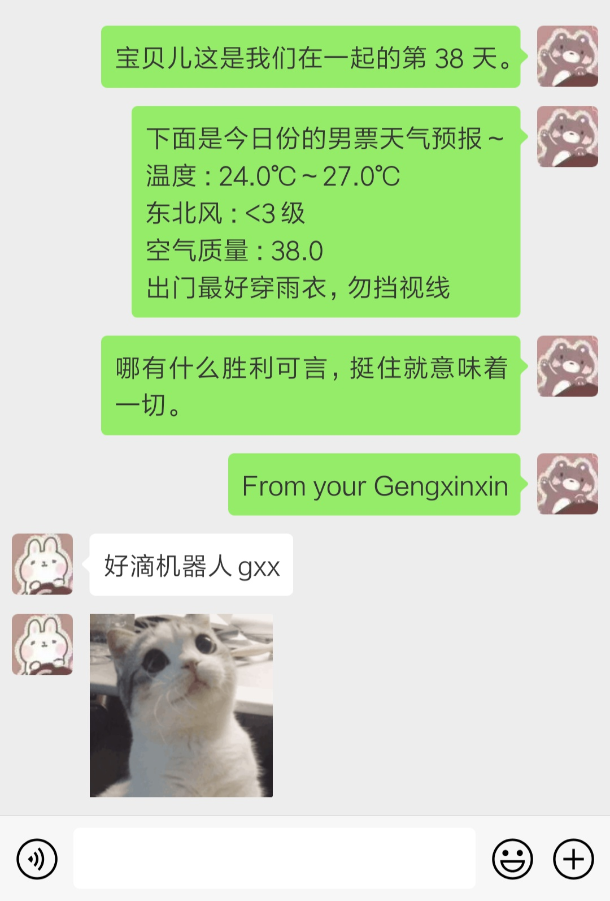
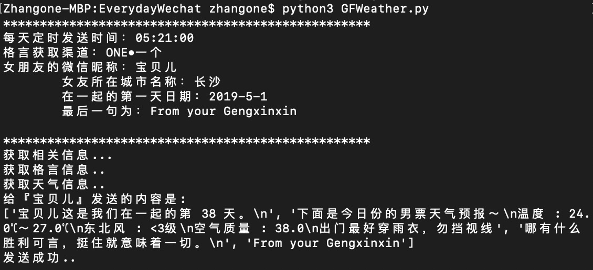
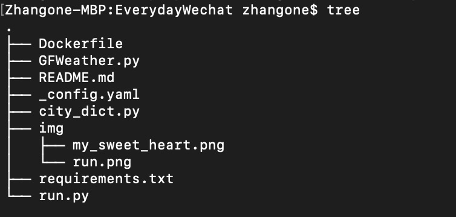

  
# 用 Python + itchat 写一个爬虫脚本每天定时给多个女友发给微信暖心话
> 原repo的README写的太乱了，重写一个
> Fork自 [https://github.com/sfyc23/EverydayWechat](https://github.com/sfyc23/EverydayWechat)
  
## 项目介绍：

开发环境：Python >= 3.6
        Docker

### 灵感来源

在即刻上看到有程序员男朋友给女票做了早安机器人，女票当即表示给我也整一个！  
那咱就开始了  
Fork了那位程序员的代码，做了些宝贝儿更喜欢的适配和修改  

### 项目地址：
Github: [https://github.com/Gengxin-Zhang/EverydayWechat](https://github.com/Gengxin-Zhang/EverydayWechat)。

### 使用库
- [itchat][2] - 微信个人号接口
- [requests][3] - 网络请求库
- [beautifulsoup4][4] - 解析网页
- [APScheduler][5] - 定时任务

### 功能
定时给女朋友发送每日天气、提醒、每日一句。  


### 数据来源
- 每日一句和上面的大佬一样也是来自 [ONE●一个][6]
- 天气信息来自 [SOJSON][7] 

### 实现效果
  
  

## 代码说明

### 目录结构
  

- city_dict.py ：城市对应编码字典  
- config.yaml ：设置定时时间，女友微信名称等参数  
- GFWeather.py：核心代码  
- requirements.txt：需要安装的库  
- run.py：项目运行类  
- Dockerfile: Docker配置文件

### 核心代码

#### 1.定时任务。
每天 5:21 给女朋友们开始给女朋友发送内容。
```
# 定时任务
scheduler = BlockingScheduler()
scheduler.add_job(start_today_info, 'cron', hour=5, minute=21, second=0)
scheduler.start()
```
*start_today_info* 是方法处理类。

#### 2.获取每日一句。
数据来源 1： [ONE●一个][6]
```
def get_dictum_info(self):
    '''
    获取格言信息（从『一个。one』获取信息 http://wufazhuce.com/）
    :return: str 一句格言或者短语
    '''
    print('获取格言信息..')
    user_url = 'http://wufazhuce.com/'
    resp = requests.get(user_url, headers=self.headers)
    soup_texts = BeautifulSoup(resp.text, 'lxml')
    # 『one -个』 中的每日一句
    every_msg = soup_texts.find_all('div', class_='fp-one-cita')[0].find('a').text
    return every_msg
```
数据来源 2： [金山词霸 ● 每日一句](http://open.iciba.com/?c=api)  

有英文和中文翻译，例如：
> When you finally get your own happiness, you will understand the
> previous sadness is a kind of treasure, which makes you better to hold
> and cherish the people you love.
> 等你获得真正属于你的幸福之后，你就会明白一起的伤痛其实是一种财富，它让你学会更好地去把握和珍惜你爱的人。

代码实现 ：
```
 def get_ciba_info(self):
    '''
    从词霸中获取每日一句，带英文。
    :return:
    '''
    resp = requests.get('http://open.iciba.com/dsapi')
    if resp.status_code == 200 and self.isJson(resp):
        conentJson = resp.json()
        content = conentJson.get('content')
        note = conentJson.get('note')
        # print(f"{content}\n{note}")
        return f"{content}\n{note}\n"
    else:
        print("没有获取到数据")
        return None
```
#### 3. 获取今日天气 。
天气数据来源：[SOJSON][7]

```
def get_weather_info(self, city_code=''）：
    weather_url = f'http://t.weather.sojson.com/api/weather/city/{city_code}'
    resp = requests.get(url=weather_url)
    if resp.status_code == 200 and resp.json().get('status') == 200:
        weatherJson = resp.json()
        # 今日天气
        today_weather = weatherJson.get('data').get('forecast')[1]
```
city_code 城市对应 id。
[http://cdn.sojson.com/_city.json](http://cdn.sojson.com/_city.json)

#### 4. 登录微信并发送内容。
```
itchat.auto_login()
itchat.send(today_msg, toUserName=name_uuid)
```


## 项目运行

### 安装依赖

使用 pip install -r requirements.txt 安装所有依赖

### 参数配置
config.yaml
```
# 定时时间
alarm_timed: '9:30'

# 格言渠道
# 1 : ONE●一个
# 2 : 词霸（每日英语）
dictum_channel: 2

girlfriend_infos:
  -
    #女友微信昵称
    wechat_name: '古典'
    #女友所在桂林
    city_name: '桂林'
    # 从那天开始勾搭的（可空）
    start_date: '2017-11-11'
    # 短句的最后留言（可空）
    sweet_words: '来自最爱你的我。'

  #如果有你多个人需要发送，则参照这个样式，复制即可
  -
    wechat_name: '陈老师'
    city_name: '朝阳区'
    start_date: '2018-11-11'
    sweet_words: '来自你俊美的老公。'
```

### 开始运行
```
sudo docker build -t everydaywechat .
sudo docker run --name girlfriend everydaywechat 
# 扫码登陆
Ctrl+P+Q 退出Docker环境
```

## 最后
Github: [https://github.com/Gengxin-Zhang/EverydayWechat](https://github.com/Gengxin-Zhang/EverydayWechat)。
> Fork自： [https://github.com/sfyc23/EverydayWechat](https://github.com/sfyc23/EverydayWechat)


  [1]: https://juejin.im/post/5c77c6bef265da2de6611cff
  [2]: https://github.com/littlecodersh/ItChat
  [3]: http://docs.python-requests.org/en/master/
  [4]: https://www.crummy.com/software/BeautifulSoup/bs4/doc/index.zh.html#
  [5]: https://apscheduler.readthedocs.io/en/latest/
  [6]: http://wufazhuce.com/
  [7]: https://www.sojson.com/blog/305.html